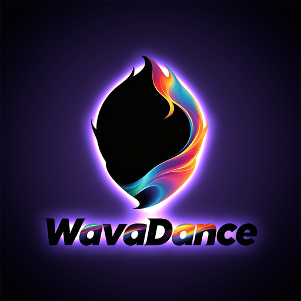
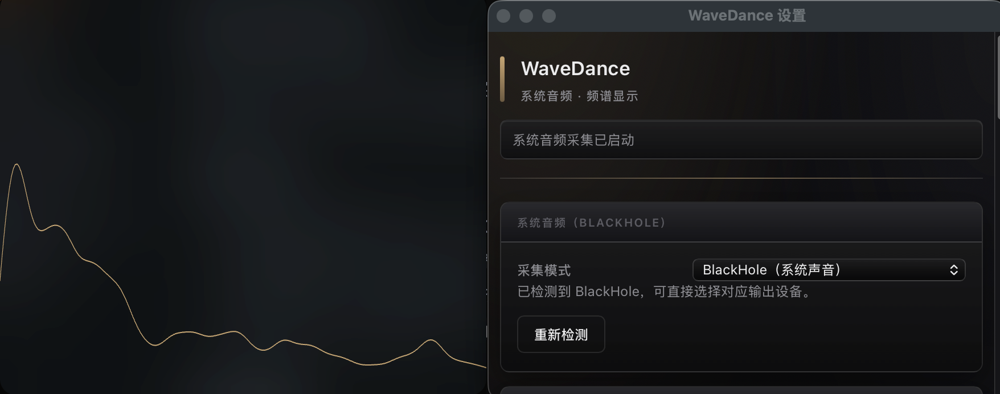

# WaveDance

WaveDance 是一个面向 macOS 的实时音频可视化桌面应用。  
项目基于 Tauri（Rust + Web）构建，采集系统播放音频并实时绘制频谱浮层。



## 效果预览



在设置页「展示模式」中可实时切换 **28 种**可视化样式（每种模式均有独立颜色、形状与持久化配置），分为 **Vanilla WebGL** 与 **Three.js 高阶** 两组：

#### Vanilla WebGL（16 种）

| 分组 | 模式 | 说明 |
|------|------|------|
| 2D 基础 | 线状图 | 经典折线频谱，可调线宽与颜色 |
| | 柱状图 | 矩形频谱柱，支持横/竖向、镜像与峰值保持线 |
| | 填充波形 | 曲线下方半透明填充，可选纵向渐变与中心对称 |
| | 渐变频谱柱 | 柱状图 + 按频率索引双色渐变着色 |
| | 霓虹发光线 | 核心亮线 + 多层外晕，透明浮层氛围感强 |
| | 霓虹圆形 | 圆周霓虹发光线，支持环半径与旋转 |
| | 圆形频谱 | 频谱桶沿圆周辐射的扇形条 |
| | 瀑布频谱 | 滚动历史热力图，横轴频率、纵轴时间 |
| | 环形圆点 | 圆周圆点，振幅驱动大小与亮度 |
| | 示波器 | 时域波形显示（需后端推送波形帧） |
| 2.5D / 3D | 斜透视频谱柱 | 街机风格透视柱，远近缩放与明暗 |
| | 多层景深 | 同一频谱多层叠放，伪深度舞台感 |
| | 等距天际线 | 30° 等距投影建筑天际线 |
| | 3D 旋转圆环 | 真 3D 扇形柱圆环，绕 Y 轴自转 |
| | 3D 频谱地形 | 网格地毯起伏，频率×时间×幅度 |
| | 3D 螺旋频谱 | 频谱点沿 3D 螺旋分布并旋转 |

#### Three.js 高阶（14+ 种）

基于 [Three.js](https://threejs.org/) + [postprocessing](https://github.com/pmndrs/postprocessing) 实现，设置页下拉中归在「Three 高阶」分组：

| 方案包 | 模式 | 说明 |
|--------|------|------|
| A 霓虹宇宙 | 等离子场 | 全屏噪声等离子，频谱驱动色相与扰动 |
| | 粒子银河 | 盘状粒子银河，bass/treble 驱动收拢与扩散 |
| | 能量隧道 | 相机前进隧道，两侧能量墙与中心脉冲 |
| | 能量球 | 球体顶点噪声形变 + 粒子光晕 |
| B 赛博故障 | 万花筒 | 6/8 瓣镜像对称频谱几何 |
| | 故障频谱 | 强拍触发 RGB 分离、扫描线与块错位 |
| | 磷光余辉 | 频谱线长拖尾，模拟 CRT 磷光 |
| | 扫描网格 | 3D 线框网格 + 扫描光束高亮 |
| C 有机流体 | 液态球体 | 多 blob 近似融合，低频驱动体积脉动 |
| | 极光飘带 | 3D 曲线飘带，频带分驱色相与摆动 |
| | 呼吸光环 | 多层同心环，peak 驱动缩放脉冲 |
| | 噪声地貌 | Simplex 噪声地貌 + 频谱调制高度 |
| D 音域地形 | 音域回响 | CPU 高度场柱网 + bass 涟漪 + treble 流星（v1，见 `docs/SOUND_FIELD_DEV.md`） |
| | **音域回响 2** | GPU Shader 棋盘地形：8 段地面 EQ、Kick/Snare 涟漪、流星、外围浮动块、专辑封面与 5 套主题（见 `docs/SONIC_TOPOGRAPHY_DEV.md`） |

> 完整实施记录与架构说明见 `docs/VISUALIZATION_MODES_PLAN.md`；音域回响 v1 / v2 并列维护，配置键前缀分别为 `threeSoundField*` 与 `threeSoundField2*`。

## 项目特性

- 系统音频实时频谱可视化（Vanilla WebGL + Three.js，28 种展示模式可切换）
- 可调节频谱参数（分桶、模式、补偿、频率区间）
- 透明浮层窗口，支持置顶模式切换
- 支持输出 macOS 安装产物（`.app`、`.dmg`）

## 运行环境

- macOS 12 及以上
- Rust 工具链（`cargo` 可用）
- Node.js 与 npm
- Xcode Command Line Tools

## 快速开始

### 1) 安装前端依赖

在项目根目录执行：

```bash
cd frontend
npm install
```

前端可视化除 Vite / Tauri API 外，还依赖 **`three`**（3D 渲染引擎）与 **`postprocessing`**（Bloom、故障、磷光等后处理）；`npm install` 会自动拉取，无需单独安装。

### 2) 启动开发模式

回到项目根目录执行：

```bash
cd ..
cargo tauri dev
```

启动后：

- Tauri 会自动拉起前端开发服务器（默认 `http://localhost:5173`）
- 桌面窗口会接收后端推送的 `waveform-frame` 并实时渲染

## 打包发布

推荐使用一键脚本：

```bash
./scripts/build-macos.sh
```

打包细节与常见问题排查见 `BUILD_MACOS.md`。

## 音频回环说明（重要）

macOS 不支持在无额外配置下直接读取系统播放音频。  
WaveDance 在 `blackhole` 模式下会优先匹配虚拟音频设备（如 BlackHole）作为系统输出回环源；若未匹配到，则会回退到系统默认输入设备（可能是麦克风）。

建议首次使用流程：

1. 安装 BlackHole（或其他可用回环设备）
2. 将系统输出切换到该回环设备
3. 启动 WaveDance，确认频谱随声音变化

## 权限与排障

- 打包配置已包含麦克风用途描述（用于系统音频输入链路授权）
- 若安装后无频谱数据，建议按顺序排查：
  1. 确认使用最新打包产物
  2. 删除旧版本后重新安装
  3. 重置麦克风权限缓存

```bash
tccutil reset Microphone com.wavedance.desktop
```

## 相关文档

- [最终用户安装说明](docs/INSTALL.md)
- [macOS 打包说明](BUILD_MACOS.md)
- [快速上下文](docs/QUICK_CONTEXT.md)
- [可视化模式扩展方案](docs/VISUALIZATION_MODES_PLAN.md)
- [当前执行上下文](PROJECT_CONTEXT.md)
- [历史实现轨迹](docs/CHANGELOG_AGENT.md)
